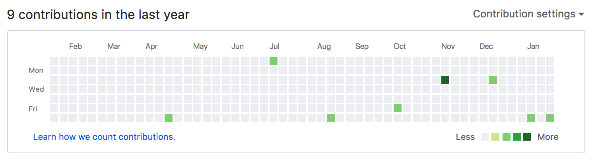
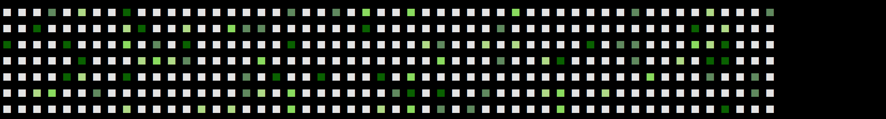

# Contributions Graph 芸
## 第33回シェル芸勉強会 大阪サテライトLT
## 2018/1/27
## so

- [スライド](https://horo17.github.io/github-contributions-graph-gei/)

>>>

## `$ whoami`


* so ([@3socha](https://twitter.com/3socha))
* インフラエンジニア (AWS/Azure)

---

## GitHub Contributions Graph

これ



進捗ダメ

>>>

## ハックする方法

[ github contributions graph hack ] [🔍検索](https://www.google.co.jp/search?q=github+contributions+graph+hack&tbm=isch)

- 適当に commit date だか author date だかをいじってコミットすれば良い、はず
    - ちゃんと調べてません
- [GitHub 芝生入門/芝生応用 - Qiita](https://qiita.com/sta/items/2c1f0252a6a9ce5e2087)

---

## 進捗良い Contributions Graph を
## CLI 上で簡単に出したい

>>>

## 芝生の色の調査

- [ANSI カラー](https://en.wikipedia.org/wiki/ANSI_escape_code)で `■` に色を付けて出力

| Commit | CSS Color Code | RGB (6段階) | ANSI Color Code |
| --- | --- | --- | --- |
| 0 | <span style="color:#eeeeee">#eeeeee</span> |  -  | <span style="color:#e4e4e4">254</span> |
| 1 | <span style="color:#c6e48b">#c6e48b</span> | 342 | <span style="color:#afd787">150</span> |
| 2 | <span style="color:#7bc96f">#7bc96f</span> | 241 | <span style="color:#87d75f">113</span> |
| 3 | <span style="color:#239a3b">#239a3b</span> | 121 | <span style="color:#5f875f">65</span> |
| 4 | <span style="color:#196127">#196127</span> | 010 | <span style="color:#005f00">22</span> |

- `ANSI Color Code = 36 * R + 6 * G + B + 16`
- それっぽい色を選択

>>>

## 適当に芝生を育ててみる

```
$ cat /dev/urandom | xxd -p | head -7 \
| grep -o . | head -n 364 \
| awk '{
    switch($0){
    case 1: v=150; break;
    case 2: v=113; break;
    case 3: v=65; break;
    case 4: v=22; break;
    default: v=254
  }
  printf "\033[38;5;"v"m■ "
}' \
| grep -oP '(?:\e[^\e]*){7}' | rs -T | sed -E 's/ +/ /g'
```

- とりあえず `awk` でやってみたが、`sed` でやればよかったかも

>>>

## ちょっと進捗良い気分を味わえた


